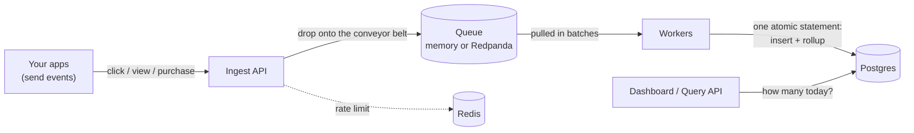

# Tally

**A high-throughput event counting & analytics service — built to stay fast and lose nothing under heavy load.**

Tally swallows a firehose of "this happened" events (clicks, views, purchases), counts them all without dropping any, and answers "how many happened?" instantly. It's a small, from-scratch version of the engine behind tools like Google Analytics or Mixpanel.

[](https://github.com/shreyas463/tally/actions/workflows/ci.yml)


<!-- Demo gif goes here once recorded (see docs/media/README.md) -->
<!--  -->

---

## What is this? (in plain English)

Tally is a **counting machine** for things that happen on an app or website.

Picture an online store with a **"Buy" button**:

- Every time someone clicks Buy, the store sends Tally a tiny message: *"someone clicked Buy."*
- Tally's one job is to **keep count**.
- Later, the store owner asks: *"how many people clicked Buy today?"* — and Tally instantly answers: *"5,000."*

Messages pour **in**, totals come **out**. The reason this is a whole project — and not a 10-minute task — is **scale**: real apps generate events tens of thousands of times per second, non-stop. Counting that fast without slowing down, losing events, or double-counting is the hard, interesting part.

---

## Features

- **High-volume ingest** — accepts events fast because it never makes a caller wait on the database (queue in the middle, batched writes behind).
- **Loses nothing** — graceful shutdown drains every accepted event; in durable mode, even a `SIGKILL`ed worker loses zero events (there's a [script that proves it](scripts/chaos.sh)).
- **Never double-counts** — every write is idempotent; retries, crashes, and duplicate sends can't inflate a number.
- **Instant answers** — per-minute rollups make "how many today?" a summation over a few hundred rows, not a scan over millions.
- **Protects itself** — per-client rate limits (429) and queue-full backpressure (503 + Retry-After) instead of falling over.
- **Observable** — Prometheus metrics, pprof profiling, a provisioned Grafana dashboard, and a built-in live dashboard at `/`.
- **Honest numbers** — [BENCHMARKS.md](BENCHMARKS.md) publishes measured results only, with the methodology to reproduce them.

---

## How it works (the journey of one event)



1. **An app sends an event** → the **Ingest API** validates it and drops it on a **queue**, replying `202` immediately. Accept fast, process later.
2. **Workers** pull events off in **batches** (1,000 at a time or every 200ms) — one database round-trip per batch instead of per event.
3. Each batch lands in **one atomic SQL statement** that inserts the raw events, skips duplicates, and increments per-minute rollup counters — counting only rows that were *actually* inserted, so a replayed batch can't double-count.
4. The **dashboard and query API** read the rollups for instant answers.

### Two queue backends

| | `QUEUE=memory` (default) | `QUEUE=kafka` |
|---|---|---|
| What it is | Bounded in-process channel | Redpanda (Kafka API) broker |
| Speed | Fastest | An extra hop (the durability tax) |
| Survives a crash/restart | Queued events die with the process | **Yes** — offsets commit only *after* a batch is stored, so killed workers' work is redelivered and deduped |
| Scale shape | One process | `MODE=ingest` / `MODE=worker` run and scale as separate processes |

That "commit only after storing, dedupe on replay" pair is the classic **at-least-once delivery + idempotent consumer** pattern — [ADR 0003](docs/adr/0003-durable-queue-and-crash-safety.md) explains it and its honest limits.

---

## Quick start

**Prerequisites:** [Go 1.22+](https://go.dev/dl/) and [Docker](https://www.docker.com/).

```bash
make up        # start Postgres + Redis
make migrate   # create tables
make run       # start Tally on http://localhost:8080
```

Open **http://localhost:8080** — that's the live dashboard. Then:

```bash
# Send one event
curl -X POST http://localhost:8080/v1/events \
  -H 'Content-Type: application/json' \
  -d '{"event_id":"evt-1","name":"buy_click","distinct_id":"user_42"}'

# Ask how many happened today
curl "http://localhost:8080/v1/counts?event=buy_click"
# => {"event":"buy_click","count_today":1}

# Send the SAME event again — the count stays 1 (idempotency)
curl -X POST http://localhost:8080/v1/events \
  -H 'Content-Type: application/json' \
  -d '{"event_id":"evt-1","name":"buy_click","distinct_id":"user_42"}'
```

Fire fake traffic and watch the dashboard tick:

```bash
make loadtest                                  # ~2,000 events/sec for 10s
go run ./cmd/loadgen -rate 5000 -duration 30s  # heavier, with p50/p95/p99 report
go run ./cmd/loadgen -rate 1000 -dupes 20      # 20% duplicate sends — counts stay exact
```

### Durable mode + the chaos demo

```bash
make kafka-up                  # adds Redpanda
make build
make chaos                     # kills a worker mid-stream, proves 0 events lost
```

### Metrics stack

```bash
make obs-up                    # Prometheus :9090 + Grafana :3000 (dashboard pre-provisioned)
```

---

## API

| Method | Path | Purpose |
|---|---|---|
| `POST` | `/v1/events` | Ingest one event: `{event_id, name, distinct_id, properties?}` → `202`, `429` (over your rate limit), or `503` (backpressure) |
| `GET` | `/v1/counts?event=NAME` | Today's count for one event name |
| `GET` | `/v1/stats` | Today's totals per name + last-15-min per-minute series |
| `GET` | `/` | Built-in live dashboard |
| `GET` | `/metrics` | Prometheus metrics |
| `GET` | `/healthz` | Liveness |
| `GET` | `/debug/pprof/` | Profiling |

## Configuration (env vars)

| Variable | Default | Meaning |
|---|---|---|
| `ADDR` | `:8080` | Listen address |
| `DATABASE_URL` | local dev DSN | Postgres connection string |
| `QUEUE` | `memory` | `memory` or `kafka` |
| `MODE` | `all` | `all`, `ingest`, or `worker` (kafka only) |
| `QUEUE_SIZE` | `100000` | Queue capacity (memory) / max buffered records (kafka) |
| `BATCH_SIZE` | `1000` | Events per database write |
| `FLUSH_INTERVAL` | `200ms` | Max wait before a partial batch is written |
| `WORKERS` | `4` | Worker goroutines (memory mode) |
| `KAFKA_BROKERS` | `localhost:9092` | Comma-separated brokers |
| `KAFKA_TOPIC` / `KAFKA_GROUP` | `tally.events` / `tally-workers` | Topic and consumer group |
| `RATE_LIMIT_RPS` | `0` (off) | Per-client events/sec (`X-API-Key` or IP) |
| `RATE_LIMIT_BURST` | `2×RPS` | Burst allowance (in-memory limiter) |
| `REDIS_ADDR` | `""` | Set to enforce the rate limit globally across instances |

---

## Architecture notes (technical)

- **Ingest** ([internal/ingest](internal/ingest)) — validates, rate-limits, enqueues, returns. Never blocks on Postgres.
- **Queue** ([internal/queue](internal/queue)) — bounded channel, or Kafka producer/consumer (franz-go) behind the same `Enqueue` contract. Full queue → `ErrFull` → `503 Retry-After`.
- **Workers** ([internal/worker](internal/worker)) — size-or-time batching, bounded retries with backoff, partial-batch flush on shutdown. In kafka mode the consumer commits offsets only post-insert.
- **Store** ([internal/store](internal/store)) — one CTE does insert + dedupe + rollup atomically; counts derive from actually-inserted rows only.
- **Shutdown ordering** — stop HTTP → drain queue → flush workers → close pool. Accepted events always land.
- **Design decisions** — written up as ADRs in [docs/adr/](docs/adr): the queue-in-the-middle, delivery semantics ("exactly-once is a lie"), and the rate-limit/backpressure split.

## Benchmarks

Methodology, profiling instructions, and result tables live in [BENCHMARKS.md](BENCHMARKS.md). Numbers get published only after they're measured on real hardware — accepted-vs-stored must reconcile to zero loss for a run to count.

## Deploying

- **Docker:** `make docker` (multi-stage build, distroless, ~20 MB).
- **Kubernetes:** manifests + walkthrough in [deploy/k8s](deploy/k8s).

## Roadmap

- [x] **Phase 0** — walking skeleton: receive → store → query
- [x] **Phase 1** — queue, batching workers, atomic rollups, graceful drain, backpressure
- [x] **Phase 2** — durable queue (Redpanda), split ingest/worker, chaos script
- [ ] **Phase 3** — publish measured benchmarks + flame graphs + chaos results ([tooling ready](BENCHMARKS.md))
- [x] **Phase 4** — rate limiting, metrics + Grafana, live dashboard, Docker/k8s/CI
- [ ] **Later** — gRPC ingest, ClickHouse for heavy aggregation, HyperLogLog uniques

## License

MIT © Shreyas Chaudhary
