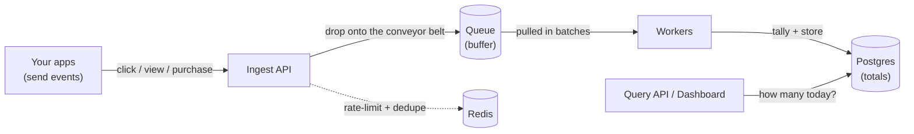

# Tally

**A high-throughput event counting & analytics service — built to stay fast and lose nothing under heavy load.**

Tally swallows a firehose of "this happened" events (clicks, views, purchases), counts them all without dropping any, and answers "how many happened?" instantly. It's a small, from-scratch version of the engine behind tools like Google Analytics or Mixpanel.

<!-- Badges — uncomment once CI is set up


-->

<!-- Demo gif goes here once the dashboard + load test exist (see docs/media) -->
<!--  -->

---

## What is this? (in plain English)

Tally is a **counting machine** for things that happen on an app or website.

Picture an online store with a **"Buy" button**:

- Every time someone clicks Buy, the store sends Tally a tiny message: *"someone clicked Buy."*
- Tally's one job is to **keep count**.
- Later, the store owner asks: *"how many people clicked Buy today?"* — and Tally instantly answers: *"5,000."*

Messages pour **in** ("this happened", "this happened"…), and totals come **out** ("it happened 5,000 times").

The reason this is a whole project — and not a 10-minute task — is **scale**. Counting a few clicks is trivial. But real apps have things happening *tens of thousands of times per second*, non-stop. Doing that without slowing down or losing a single event is the hard, interesting part.

---

## The problem it solves

Businesses need to know what their users are doing — which features get used, whether traffic is growing, what's converting. But at high volume, the naive approach (save every single event straight to a database the moment it arrives) gets slow and starts dropping data. Tally is the reliable machinery that sits in the middle and makes that counting survive real scale and even crashes.

---

## Features

- **Ingests events at high volume** — an HTTP API that accepts a heavy stream of events without slowing down.
- **Loses nothing** — even if a background worker crashes mid-job, no events are dropped.
- **Doesn't double-count** — a duplicate event (networks resend sometimes) is counted only once.
- **Answers questions instantly** — keeps running totals, so "how many today?" returns immediately.
- **Protects itself** — per-client rate limiting and backpressure ("slow down, I'm full") instead of crashing.
- **Proven, not just claimed** — load-tested with real, published numbers (see [Benchmarks](#benchmarks)).

---

## How it works (the journey of one event)



1. **An app sends an event** → the **Ingest API** catches it.
2. The API immediately drops it onto a **queue** (a conveyor belt) and replies "got it" — it does *not* wait to save it. Accept fast, process later.
3. **Workers** pull events off the belt in **batches** (saving 1,000 at once is far faster than one at a time).
4. Workers **tally** the events and store the running totals in **Postgres**.
5. The **Query API / dashboard** reads those totals to answer "how many?" instantly.

> **Today (Phase 0)** the Ingest API writes straight to Postgres — the simplest version that works end-to-end. The queue and workers land in Phase 1 (see [Roadmap](#roadmap)).

---

## Architecture (technical)

- **Ingest API** — Go HTTP (later gRPC) handler. Validates events, applies per-key rate limiting (Redis token bucket), and enqueues. Returns fast; never blocks on the database.
- **Queue** — a buffered channel to start (Phase 1), swapped for a real broker (NATS or Kafka via Redpanda) to survive restarts (Phase 2).
- **Workers** — a pool of goroutines consuming the queue, batching writes, and doing idempotent upserts so duplicates and retries can't corrupt counts.
- **Store** — Postgres, with batch upserts and time-based partitioning for the aggregate tables.
- **Delivery guarantee** — **at-least-once** delivery + **idempotent consumers**. (Exactly-once across a network is effectively a myth; the writeup in `docs/adr/` explains why and where dedupe actually happens.)
- **Reliability** — graceful shutdown drains in-flight work on `SIGTERM`; backpressure returns `429`/`503` rather than dropping data.
- **Observability** — Prometheus metrics + Grafana dashboards; `pprof` for profiling.

---

## Tech stack

| Concern | Choice |
|---|---|
| Language | Go |
| Queue | Buffered channel → NATS / Redpanda (Kafka API) |
| Storage | Postgres (+ ClickHouse later for fast aggregation) |
| Cache / rate limiting | Redis |
| Load testing | k6 |
| Observability | Prometheus + Grafana, pprof |
| Deploy | Docker Compose → Kubernetes |

---

## Quick start

**Prerequisites:** [Go 1.22+](https://go.dev/dl/) and [Docker](https://www.docker.com/) installed.

```bash
make setup     # download Go dependencies
make up        # start Postgres + Redis in Docker
make migrate   # create the events table
make run       # start Tally on http://localhost:8080
```

Then, in another terminal, send an event and read the count:

```bash
# Send one "buy_click" event
curl -X POST http://localhost:8080/v1/events \
  -H 'Content-Type: application/json' \
  -d '{"event_id":"evt-1","name":"buy_click","distinct_id":"user_42"}'

# Ask how many "buy_click" events happened today
curl "http://localhost:8080/v1/counts?event=buy_click"
# => {"event":"buy_click","count_today":1}
```

Fire a burst of fake traffic at it:

```bash
make loadtest   # sends ~2,000 events/sec for 10s
```

---

## API

| Method | Path | Purpose |
|---|---|---|
| `POST` | `/v1/events` | Ingest one event. Body: `{event_id, name, distinct_id, properties?}` |
| `GET`  | `/v1/counts?event=NAME` | How many events of `NAME` happened today |
| `GET`  | `/healthz` | Liveness check |

---

## Benchmarks

_Coming in Phase 3._ Will include throughput (events/sec) and p50/p99 latency, before/after each optimization, with pprof flame graphs. See [BENCHMARKS.md](BENCHMARKS.md).

---

## Design decisions

Written up as short ADRs in [`docs/adr/`](docs/adr/): queue choice, delivery semantics, and database schema.

---

## Roadmap

- [x] **Phase 0** — Receive an event → save straight to Postgres → query it. (walking skeleton)
- [ ] **Phase 1** — Add the queue, batching workers, graceful shutdown, idempotency.
- [ ] **Phase 2** — Real message broker; make it survive restarts.
- [ ] **Phase 3** — Load tests + published benchmarks + a "kill a worker, lose nothing" chaos demo.
- [ ] **Phase 4** — Dashboard, rate limiting, Prometheus/Grafana, Kubernetes deploy.

---

## License

MIT © Shreyas Chaudhary
